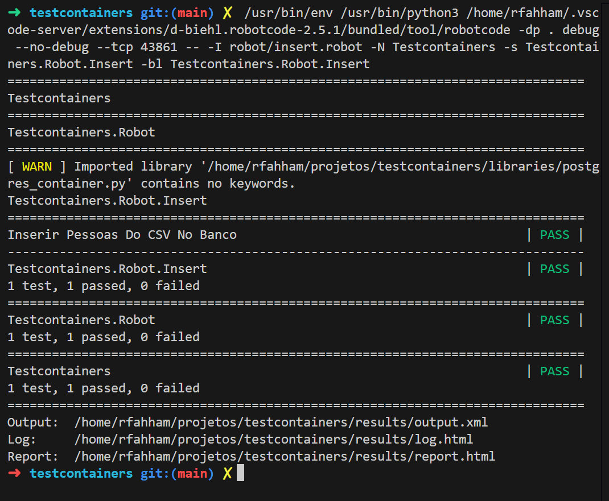

# Testcontainers

**Testcontainers** é uma biblioteca/framework que permite criar ambientes de teste reais usando containers Docker durante a execução dos testes automatizados.

Em vez de usar “mocks” ou bancos em memória, você sobe dependências reais — como PostgreSQL, Redis, Kafka, Elasticsearch etc. — dentro de containers temporários controlados pelo teste.

Exemplo:

* Seu backend precisa de PostgreSQL para rodar testes de integração.
* O Testcontainers inicia automaticamente um container PostgreSQL limpo.
* O teste roda usando esse banco real.
* Ao terminar, o container é destruído.

Isso resolve vários problemas comuns:

* “Na minha máquina funciona”
* Diferenças entre ambientes
* Dependências difíceis de configurar
* Testes frágeis ou irreais

---

## Como funciona

Fluxo típico:

1. O teste inicia
2. O Testcontainers conversa com o Docker
3. Containers necessários são criados
4. O teste executa
5. Tudo é removido automaticamente

---

## Exemplo simples (python + PostgreSQL)

### 1. Instalar dependências

#### Instalando o Robot Framework `robotframework` que serve para executar testes automatizados:

```bash
pip install robotframework
```

Verificar a versão instalada:

```bash
pip show robotframework
Name: robotframework
Version: 7.1.1
Summary: Generic automation framework for acceptance testing and robotic process automation (RPA)
Home-page: https://robotframework.org
Author: Pekka Klärck
Author-email: peke@eliga.fi
License: Apache License 2.0
Location: /usr/local/lib/python3.10/dist-packages
Requires: 
Required-by: robotframework-assertion-engine, robotframework-browser, robotframework-csvlibrary, robotframework-databaselibrary, robotframework-faker, robotframework-jsonlibrary, robotframework-requests, robotframework-seleniumlibrary
```

#### Instalando a biblioteca `robotframework-databaselibrary` que serve para 


```bash
pip install robotframework-databaselibrary
```

Verificar a versão instalada:

```bash
pip show robotframework-databaselibrary
Name: robotframework-databaselibrary
Version: 2.4.1
Summary: Database Library for Robot Framework
Home-page: https://github.com/MarketSquare/Robotframework-Database-Library
Author: 
Author-email: Franz Allan Valencia See <franz.see@gmail.com>
License: Apache License 2.0
Location: /home/rfahham/.local/lib/python3.10/site-packages
Requires: robotframework, robotframework-assertion-engine, sqlparse
Required-by:
```

#### Instalando a biblioteca `testcontainers` que serve para 


```bash
pip install testcontainers
```

Verificar a versão instalada:

```bash
pip show testcontainers
Name: testcontainers
Version: 4.14.2
Summary: Python library for throwaway instances of anything that can run in a Docker container
Home-page: https://github.com/testcontainers/testcontainers-python
Author: 
Author-email: Sergey Pirogov <automationremarks@gmail.com>
License-Expression: Apache-2.0
Location: /home/rfahham/.local/lib/python3.10/site-packages
Requires: docker, python-dotenv, typing-extensions, urllib3, wrapt
Required-by: 
```

#### Instalando a biblioteca `psycopg2-binary` que serve para 

```bash
pip install psycopg2-binary
```

Verificar a versão instalada:

```bash
pip show psycopg2-binary
Name: psycopg2-binary
Version: 2.9.11
Summary: psycopg2 - Python-PostgreSQL Database Adapter
Home-page: https://psycopg.org/
Author: Federico Di Gregorio
Author-email: fog@initd.org
License: LGPL with exceptions
Location: /home/rfahham/.local/lib/python3.10/site-packages
Requires: 
Required-by:
```

OU, instalar todas as bibliotecas:

```bash
pip install -r requirements.txt
```

### 2. Criando a biblioteca com o testcontainers:

Crie o arquivo: `libraries/postgres_container.py`

```python
from testcontainers.postgres import PostgresContainer


class PostgresLibrary:

    def __init__(self):
        self.postgres = None

    def start_postgres_container(self):
        self.postgres = PostgresContainer("postgres:16")
        self.postgres.start()

        return {
            "host": self.postgres.get_container_host_ip(),
            "port": self.postgres.get_exposed_port(5432),
            "dbname": self.postgres.dbname,
            "user": self.postgres.username,
            "password": self.postgres.password
        }

    def stop_postgres_container(self):
        if self.postgres:
            self.postgres.stop()
```

Nesse caso:

* O Docker baixa a imagem `postgres:16`
* Sobe um banco temporário
* O teste usa credenciais geradas automaticamente

---

## Executando o teste:

```bash
robot insert.robot
```

## Resultado

A execução do teste:



Página com os detalhes do teste:

Acesse o [resultado do teste](./results/report.html)

## Casos de uso comuns

Muito usado para:

* Testes de integração
* Testes end-to-end de backend
* CI/CD
* Microserviços
* APIs com dependências externas

Containers populares:

* PostgreSQL
* MySQL
* MongoDB
* Redis
* Kafka
* RabbitMQ
* LocalStack (AWS fake)

---

## Linguagens suportadas

O ecossistema começou forte em Java, mas hoje existe suporte para:

* Java
* Kotlin
* Go
* Node.js
* .NET
* Python
* Rust

Documentação oficial:

[Testcontainers Docs](https://testcontainers.com/?utm_source=chatgpt.com)

Java:

[Testcontainers for Java](https://java.testcontainers.org/?utm_source=chatgpt.com)

Node.js:

[Testcontainers Node.js](https://node.testcontainers.org/?utm_source=chatgpt.com)

---

## Vantagens

### Ambiente real

Você testa contra serviços reais.

### Isolamento

Cada teste pode ter ambiente limpo.

### Reprodutibilidade

CI e máquina local ficam parecidos.

### Menos configuração manual

Não precisa manter bancos locais rodando.

---

## Desvantagens

### Mais lento que mocks

Subir containers custa tempo.

### Precisa de Docker

O ambiente de execução deve ter Docker disponível.

### Pode consumir recursos

RAM e CPU aumentam dependendo dos containers.

---

## Diferença entre mocks e Testcontainers

| Mock                       | Testcontainers           |
| -------------------------- | ------------------------ |
| Simula comportamento       | Usa serviço real         |
| Muito rápido               | Mais lento               |
| Menos confiável            | Mais próximo de produção |
| Fácil de quebrar contratos | Detecta problemas reais  |

Na prática, muitos times usam:

* Unit tests → mocks
* Integration tests → Testcontainers

---

## Quando vale usar

Vale muito a pena quando:

* Você trabalha com backend
* Usa banco de dados real
* Tem microserviços
* Quer pipelines CI mais confiáveis
* Já sofreu com testes inconsistentes

É especialmente popular em projetos com:

* Spring Boot
* JUnit
* Docker
* PostgreSQL

---

